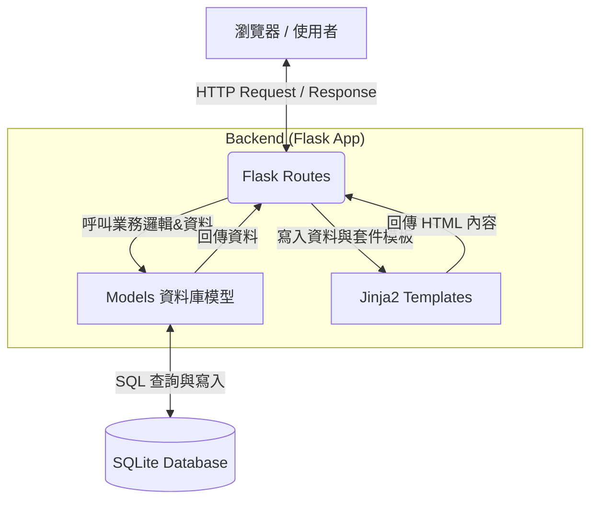

# 系統架構設計文件 (Architecture)

## 1. 技術架構說明
本專案為「線上算命系統」，依照需求將採用伺服器端渲染 (Server-Side Rendering) 架構。詳細說明如下：
- **選用技術與原因**：
  - **後端框架**：**Python + Flask**，Flask 是輕量級框架，能快速建立 API 路由與頁面渲染，非常適合此 MVP 專案。
  - **樣板引擎**：**Jinja2**，Flask 內建，能直接將後端資料注入 HTML 模板，實現動態頁面且不需要複雜的前後期分離設定。
  - **資料庫**：**SQLite**，輕量級且無需額外架設資料庫伺服器，資料儲存在單一檔案 (`.db`) 內，適合初期專案與開發測試。
  - **前端技術**：HTML, CSS, JavaScript (搭配 Bootstrap/Tailwind 等資源)，進行簡單的互動與抽籤動畫。

- **Flask MVC 模式說明**：
  - **Model (模型)**：負責與 SQLite 溝通的資料邏輯，處理資料的讀取、寫入與結構（如使用者資料、抽籤紀錄、籤詩內容）。
  - **View (視圖)**：Jinja2 所渲染的 HTML 模板，負責前端使用者介面的呈現。
  - **Controller (控制器)**：由 Flask 的路由 (Routes) 擔任，負責接收連線請求、呼叫 Model 取得資料，再將資料傳遞給 View 進行網頁顯示。

## 2. 專案資料夾結構

建議的資料夾結構如下：
```text
web_app_development/
├── app.py                # 應用程式入口點，負責啟動 Flask 伺服器
├── requirements.txt      # 記錄 Python 依賴套件 (如 flask, bcrypt 等)
├── docs/                 # 文件存放區
│   ├── PRD.md            # 產品需求文件
│   └── ARCHITECTURE.md   # 系統架構文件
├── instance/             # 不應進版控的存放區 (資料庫等)
│   └── database.db       # SQLite 資料庫檔案
├── app/                  # Flask 核心應用程式資料夾
│   ├── __init__.py       # app 模組的初始化設定 (啟動資料庫連線、載入藍圖)
│   ├── models/           # 模型層：管理資料庫的存取
│   │   ├── __init__.py
│   │   ├── user.py       # 使用者相關模型 (註冊、登入驗證)
│   │   ├── lot.py        # 抽籤與籤詩相關模型 (取得籤詩)
│   │   └── record.py     # 使用者測算紀錄模型 (歷史紀錄)
│   ├── routes/           # 路由層 (Controller)
│   │   ├── __init__.py
│   │   ├── auth.py       # 會員登入/註冊路由
│   │   ├── fortune.py    # 抽籤/占卜/結果處理路由
│   │   ├── donate.py     # 捐香油錢路由
│   │   └── main.py       # 首頁與其他雜項頁面路由
│   ├── templates/        # 視圖層：Jinja2 HTML 模板
│   │   ├── layout.html   # 全域共用的基礎樣板
│   │   ├── index.html    # 首頁
│   │   ├── auth/         # 認證相關模板 (登入/註冊)
│   │   ├── fortune/      # 算命頁面與結果模板
│   │   ├── profile/      # 會員中心 (歷史紀錄)
│   │   └── donate/       # 捐獻頁面
│   └── static/           # 靜態資源檔案
│       ├── css/
│       │   └── style.css # 自定義樣式表
│       ├── js/
│       │   └── main.js   # 抽籤動畫與其他前端互動邏輯
│       └── images/       # 籤筒、神像、社群分享 icon 等圖片
└── .gitignore            # 忽略進版控的檔案清單 (如 instance/ 等)
```

## 3. 元件關係圖

以下呈現系統各重要元件之互動與資料流：



**互動流程說明**：
1. 瀏覽器發送 Request 給 **Flask Route (Controller)**。
2. Flask Route 解析請求，有需要時呼叫 **Model** 存取 **SQLite 資料庫**（如驗證密碼、取出籤詩、寫入歷史紀錄）。
3. Model 將取回的資料庫結果回傳給 Controller。
4. Controller 將資料注入 **Jinja2 Template (View)** 產生各個節點動態的最終 HTML。
5. Controller 將渲染完成的網頁 Response 回傳給使用者的瀏覽器。

## 4. 關鍵設計決策

1. **選擇 Python + Flask 搭配 Jinja2 渲染 HTML**
   - **原因**：根據 PRD 要求，專案初期(MVP)以快速建置為優先。此種架構不需要做繁瑣的前後端分離、API 介接、跨域 (CORS) 等設定。開發效率高，且所有權限管理可以直接在伺服器端完成驗證。
2. **採用 SQLite 儲存資料**
   - **原因**：抽籤紀錄、使用者帳號以及內建的百首籤詩資料結構並不複雜。SQLite 是單檔資料庫，不須建立獨立的資料庫服務即可使用，在開發與初期上線十分方便。未來若資料量較大要轉移到 PostgreSQL 也可以輕易切換。
3. **規劃獨立的 app/ 模組與 routes/ 目錄 (藍圖 Blueprints)**
   - **原因**：為了避免所有的功能（會員、抽籤、歷史紀錄、收款）都塞在同一個 `app.py` 中造成混亂，這份架構採用了模組化的路由設計。利用 Flask 的 Blueprints 功能，可以輕易拆分專案結構，增進專屬成員協作時的程式可讀性與擴充性。
4. **將安全考量（密碼加密）納入 Models**
   - **原因**：為符合 PRD 中「密碼須加密儲存」的安全規定，建立專門的使用者 `user.py` 模型，用以集中管控使用者註冊時的 `bcrypt` 加密邏輯，維持資安層級的一致性。
