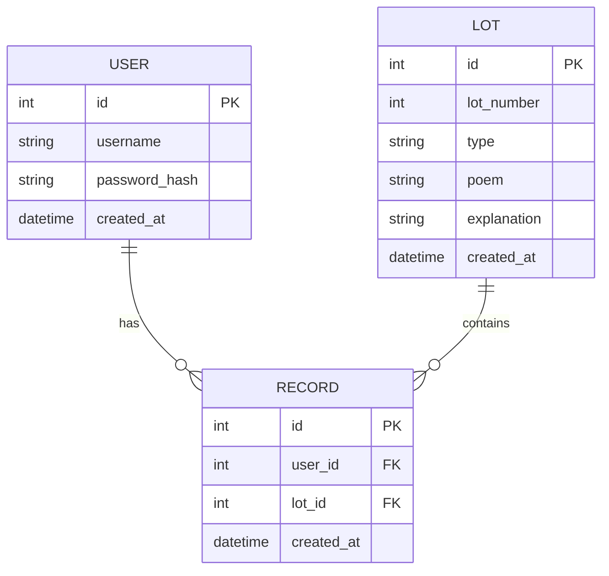

# 資料庫設計文件 (DB Design)

## 1. ER 圖（實體關係圖）

## 2. 資料表詳細說明

### 2.1 USER (使用者)
儲存註冊會員的資訊。
- `id` (INTEGER): 使用者唯一識別碼，Primary Key，自動遞增。
- `username` (TEXT): 使用者帳號，必須唯一且不可為空。
- `password_hash` (TEXT): 經過 bcrypt 加密後的使用者密碼，不可為空。
- `created_at` (DATETIME): 帳號建立時間，預設為當前時間。

### 2.2 LOT (籤詩)
儲存系統內建的籤詩資料（例如一百首觀音靈籤）。
- `id` (INTEGER): 籤詩唯一識別碼，Primary Key，自動遞增。
- `lot_number` (INTEGER): 籤詩編號，例如 1 到 100。
- `type` (TEXT): 籤的吉凶，如「大吉」、「中吉」、「下下」等。
- `poem` (TEXT): 籤詩具體內容。
- `explanation` (TEXT): 籤詩解說與指示。
- `created_at` (DATETIME): 籤詩資料建立時間，預設為當前時間。

### 2.3 RECORD (測算紀錄)
儲存使用者每次抽籤的歷史紀錄。
- `id` (INTEGER): 紀錄唯一識別碼，Primary Key，自動遞增。
- `user_id` (INTEGER): 抽籤的使用者 ID，Foreign Key 關聯至 `USER.id`。
- `lot_id` (INTEGER): 抽到的籤詩 ID，Foreign Key 關聯至 `LOT.id`。
- `created_at` (DATETIME): 抽籤的時間戳記，預設為當前時間。
