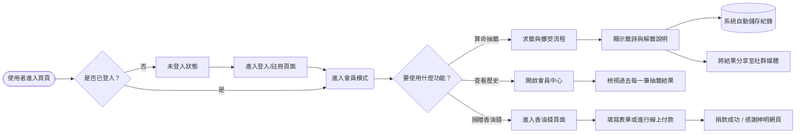
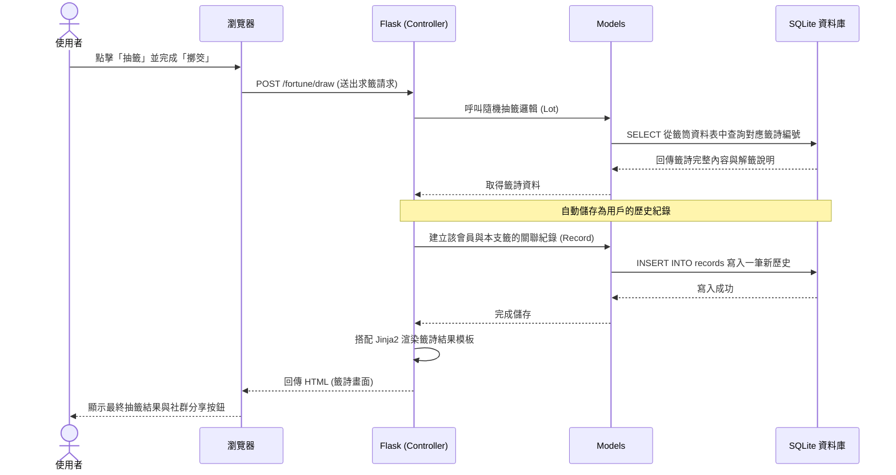

# 系統與使用者流程圖 (Flowchart)

這份文件基於 PRD 的需求與架構的規劃，展示了「線上算命系統」的使用者操作路徑、系統層互動序列，以及主要功能的網址路由對照表。

## 1. 使用者流程圖 (User Flow)

這張視圖描述了使用者從進入網站開始，經過註冊登入、抽籤測算、歷史回顧與捐香油錢等主要功能的操作路徑與決策點。

## 2. 系統序列圖 (Sequence Diagram)

這個序列圖以最核心的「抽籤並儲存結果」作為範例，模擬了「使用者瀏覽器」經過「Flask」到「SQLite」資料庫的各角色互動順序：

## 3. 功能清單對照表 (Route mapping)

以下表格列出滿足 PRD 所需的各項功能，與其預計對應的網址路徑 (URL) 以及 HTTP 方法。

| 功能模組 | URL 路徑 | HTTP 方法 | 功能說明 |
| --- | --- | --- | --- |
| **首頁** | `/` | GET | 網站進入點，提供各項功能的入口與系統介紹 |
| **註冊會員** | `/auth/register` | GET, POST | 顯示註冊表單，接收 POST 發送以建立新帳號 |
| **登入會員** | `/auth/login` | GET, POST | 顯示登入表單，驗證成功後建立系統 Session |
| **登出會員** | `/auth/logout` | GET | 登出並清除現有 Session，回到未登入狀態 |
| **抽籤流程** | `/fortune/draw` | GET, POST | 進行求籤、擲筊等核心測算行為 |
| **籤詩結果與分享** | `/fortune/result/<record_id>` | GET | 以專屬網址顯示特定一筆抽籤的結果，便於社群分享 |
| **歷史紀錄查看** | `/profile/history` | GET | 列出該會員所有過去測算與抽籤的明細紀錄 |
| **捐贈香油錢** | `/donate` | GET | 顯示香油錢捐款方案、匯款帳號或外部金流按紐 |
| **捐贈完成回傳** | `/donate/success` | GET, POST | 接收捐款成功的系統回傳，並顯示感謝畫面 |
